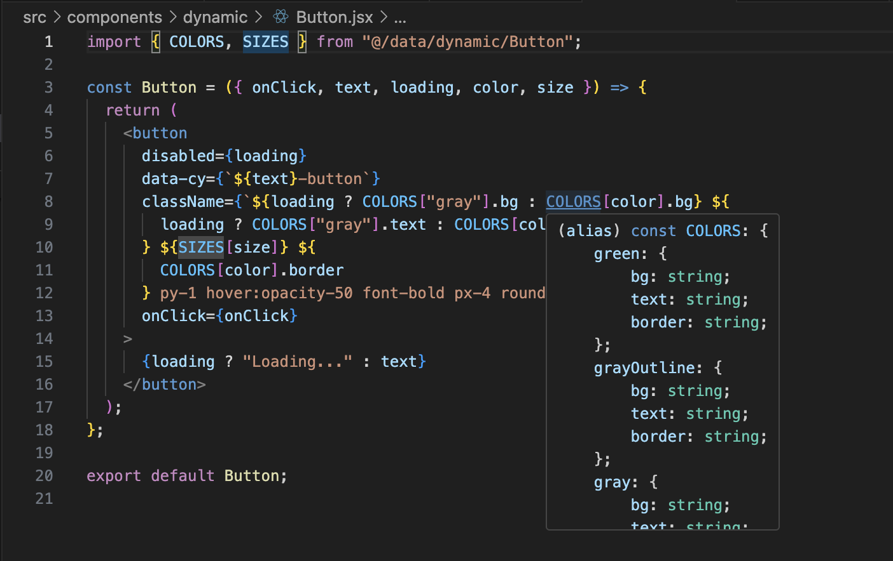

# Shortcuts on VS Code

Below are some effective ways to quickly find code and understand the internal structure of the repository you're working on. 

## Find Files
To look up a file in the repository: 

**MAC** `CMD`+`P` or **Windows** `Ctrl`+`P` and type the name of the file in the search bar. 

## Repo-Wide Search
To look up a term in the entire repository: 

**MAC** `CMD`+ `Shift` +`F` or **Windows** `Ctrl`+`Shift` +`F` and type the term in the search bar. 

## Repo-Wide Search & Replace
To look up and replace a term in the entire repository: 

**MAC** `CMD`+ `Shift` +`H` or **Windows** `Ctrl`+`Shift` +`H` and type the term to replace in the first bar and the replacement in the second bar. 

## Search Within A File
To look up a term in the current open file: 

**MAC** `CMD` +`F` or **Windows** `Ctrl`+`F` and type the term in the search bar. 

## Preview/Jump To Definition
If you run into an unknown symbol in a file, you can jump to the file where the symbol is defined. This helps to see how the files are related. Specifically, look at *import* statements.

Hover over the term and the definition preview should pop up like the following:

 

To jump to the file of the definition: **MAC** `CMD` +`Click` or **Windows** `Ctrl`+`Click` on the term.

## View File Path
On top of the open file, you can see the path like the following:

 

 ## Additional Resources
- [MAC VSCode shortcuts](https://code.visualstudio.com/shortcuts/keyboard-shortcuts-macos.pdf)
- [Windows VSCode shortcuts](https://code.visualstudio.com/shortcuts/keyboard-shortcuts-windows.pdf)

