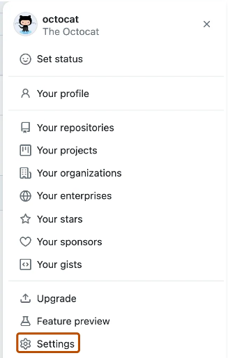

# Display Name

Changing Display Name

When working in large groups it's important to change your display name to your prefered first and last name so your teammates can identify your issues, commits, pull requests, and etc.

In the upper-right corner of any page, click your profile photo, then click **Settings**.

In the left sidebar, see  **Public Profile**.

In the "Name" field, type the name you want to be displayed on your profile.

Scroll down and click **Update profile** to save your changes.

