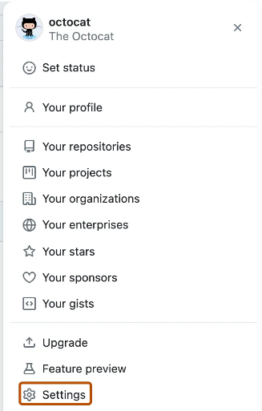
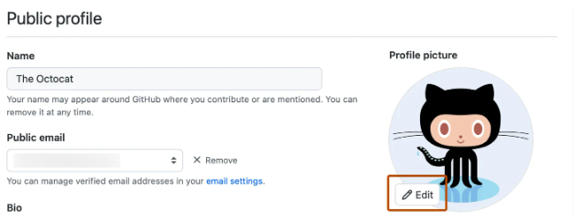

# Profile Picture

Changing Profile Picture

Having a unique profile picture allows your teammates to quickly identify your issues, commits, pull requests, and etc.

In the upper-right corner of any page, click your profile photo, then click **Settings**.

In the left sidebar, see  **Public Profile**.

Select  **Edit**, then click **Upload a photo...** 

Select an image, then click **Upload**.

Crop your picture.

Click **Set new profile picture***.