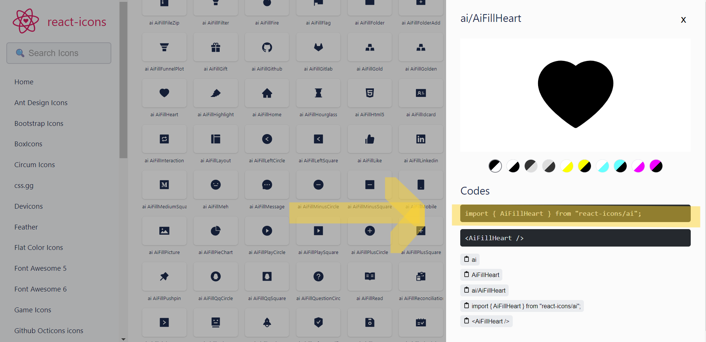

# Usage
>⭐️ You can find the collection of React Icons with its library from [React Icons](https://react-icons.github.io/react-icons/).


### Here is how you import and display desire react icon: 

1. Copy import command provided in React Icons Documentation
In [React Icons](https://react-icons.github.io/react-icons/), select desire icon to display required import commamnd. 




2. Paste the import command on the top of the file and add the icon as following:

```html
import { AiFillHeart } from "react-icons/ai";

const Home = () => {
  return (
    <div className="">
      <AiFillHeart />
    </div>
  );
};

export default Home;
```

The icon should be display as the following:


--- end of page ---