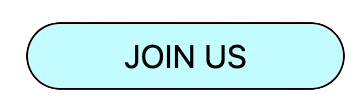

# Colors

> 💡 You can find color theme styles in the repo's `tailwind.config.js` file

> ❗ Do not use default Tailwind color styles like `red-500` or `black`. always use the colors defined in `tailwind.config.js`


Every ACM website has a personal Tailwind theme in `tailwind.config.js` based on its design doc that has custom colors. This is to avoid hardcoded and inconsistent color usage.

## Solid colors

The color style names are prefaced by the name of the website (e.g. `acm-blue-100`, `hackathon-red`, etc.).

You can directly attach these color styles to Tailwind utility classes.

In the R-Tools repo, for example, you could color the text black with `text-rtools-black` and the background teal with `bg-rtools-teal-100`.

```html
<button className="text-rtools-black bg-rtools-teal-100 px-12 py-1 border border-solid border-black rounded-full">
  JOIN US
</button>
```




## Gradient colors

### Background

> 💡  For more color gradient variations see the [Tailwind docs](https://tailwindcss.com/docs/gradient-color-stops)

To add a left-to-right background gradient, apply the `bg-gradient-to-r` class, pick the left color with `from-{color}` and the right color with `to-{color}`.

```html
<button className="bg-gradient-to-r from-rtools-teal-100 to-rtools-purple-200 px-12 py-1 border border-solid border-black rounded-full">
  JOIN US
</button>
```


### Text
> 💡  Gradient text [full tutorial](https://design2tailwind.com/blog/tailwindcss-gradient-text/)


To turn the background gradient from above into text gradient, add the `text-transparent` and `bg-clip-text` classes.

```html
<button className="text-transparent bg-clip-text bg-gradient-to-r bg-gradient-to-r from-rtools-teal-100 to-rtools-purple-200 px-12 py-1 border border-solid border-black rounded-full">
  JOIN US
</button>
```

