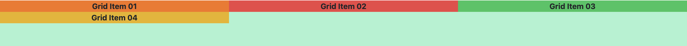
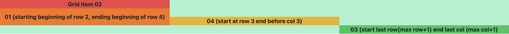

# Tailwind Grid

> 💡 [Tailwind Grid Documentation](https://tailwindcss.com/docs/grid-template-columns)

Grid is a similar layout system as flex that allows control of both rows and columns as opposed to flex's one-dimentional system. 

## Basic Grid Usage

### Defining Rows and Columns
```html
<div className="grid grid-rows-3 grid-cols-4">
  // include all items here
</div>
```

You need to first apply `grid` class to the container for all the other classes to apply. Think of it as creating a table-like structure. The code above creates a grid with 3 rows and 4 columns. You do not have to explicitly define the rows since grid will automatically adjust its rows to the provided content.

### Customizing Grid Items

#### Row/Col Spanning

By default, each grid item will take up equal space horizontally and vertically, spanning 1 row and 1 column. If you want to stretch out your grid items to take up more space, you can use **col-span-{n}** or **row-span-{n}** where *n* can be the number of rows/cols you want the specific grid item to span. For example with a 4 row x 3 col grid:

```html
<div className="grid grid-cols-3 grid-rows-4 bg-emerald-200 font-bold">
    <div className="bg-orange-500 flex justify-center items-center col-span-2 row-span-2">Grid Item 01 (2 row 2 col)</div>
    <div className="bg-red-500 flex justify-center items-center col-span-2">Grid Item 02 (2 col)</div>
    <div className="bg-green-500 flex justify-center items-center row-span-2">Grid Item 03 (2 row)</div>
    <div className="bg-yellow-500 flex justify-center items-center">Grid Item 04</div>
</div>
```
Before:

After:


`justify-center` and `items-center` position the individual grid items in the center of their specific container. You need to use `grid` or `flex` class for this to work. Check [Flexbox](flexbox.md) section for more on positioning. 

#### Row/Col Positioning

Instead of spanning, if you want to specify which row/col your grid item should start and end in, you can use **col-start-{m} col-end-{m}** and **row-start-{m} row-end-{m}** where *m* is the row or column number. For example:

```html
<div className="grid grid-cols-3 grid-rows-4 bg-emerald-200 font-bold">
    <div className="bg-orange-500 grid justify-center items-center row-start-2 row-end-4">
        01 (starting beginning of row 2, ending beginning of row 4
    </div>
    <div className="bg-red-500 flex justify-center items-center">
        Grid Item 02
    </div>
    <div className="bg-green-500 flex justify-center items-center row-start-4 col-end-4">
        03 (start last row(max row+1) end last col (max col+1)
    </div>
    <div className="bg-yellow-500 flex justify-center items-center row-start-3 col-end-3">
        04 (start at row 3 end before col 3)
    </div>
</div>;
```
 

Notice that to position at the last row or column, *m = max row or col + 1*.

You can use a combination of row/col spanning and positioning too!

#### Spacing and Ordering

To create space in a grid, you can use **gap-{val}** that adds horizontal and vertical spacing within rows and columns. To add only horizontal space do, **gap-x-{val}** and only vertical space do **gap-y-{val}**. This class goes in your parent container where you defined your grid. 

To order grid items, you can use the class **order-{}** in the individual grid item. Find more order options [here](https://tailwindcss.com/docs/order).

Checkout [Flexbox](flexbox.md) section for padding and margins for a grid item. 

### Additional Resources
- [Grid Overview](https://tailscan.com/blog/tailwind-css-grid-a-quick-overview)
- [Responsive Grid Layout](https://refine.dev/blog/tailwind-grid/#responsive-column-numbers)